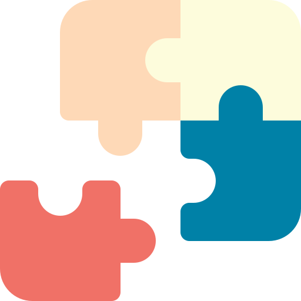
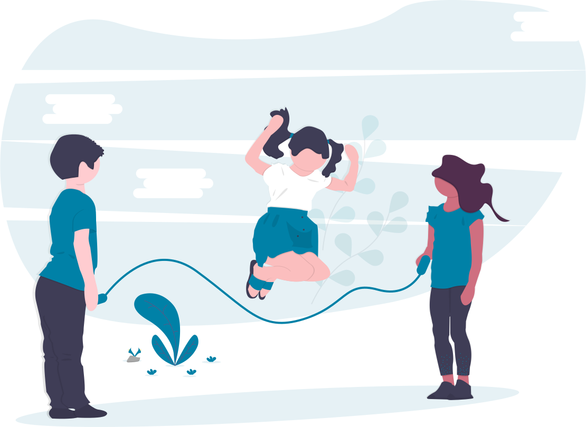

<h1 align="center">
   
   &nbsp;
Playroom

</h1>
 
<h1> Playroom Backend </h1>

   
   
   
   
   
  

> A marketplace for finding and registering toy donation places. :jigsaw:

----

   <a href="#project">Project</a>&nbsp;&nbsp;&nbsp;|&nbsp;&nbsp;&nbsp;
   <a href="#features">Features</a>&nbsp;&nbsp;&nbsp;|&nbsp;&nbsp;&nbsp;
   <a href="#integrations">Integrations</a>&nbsp;&nbsp;&nbsp;|&nbsp;&nbsp;&nbsp;
   <a href="#technologies">Technologies</a>&nbsp;&nbsp;&nbsp;|&nbsp;&nbsp;&nbsp;
   <a href="#installation">Installation</a>&nbsp;&nbsp;&nbsp;|&nbsp;&nbsp;&nbsp;
   <a href="#license">License</a>

<h1 align="center">
   
</h1>

## Project
under construction 

## Features
The main features of the project are:
- **Create** and **read** donations points.
- **Upload** images of donations points.
- **Read** donation item categories.

## Integrations
This project is part of the **Playroom** system, the other projects are located at:
- [Playroom Frontend](https://github.com/danieljpgo/playroom-frontend)
- [Playroom Mobile](https://github.com/danieljpgo/playroom-mobile)

## Technologies
The main technologies used to develop the project were:
- [Node](https://nodejs.org/en/)
- [Express](https://expressjs.com/)
- [Knex](http://knexjs.org/)
- [SQLite3](https://www.sqlite.org/version3.html)
- [Joi](https://hapi.dev/module/joi/)
- [Typescript](https://www.typescriptlang.org/)

## Installation
under construction 

## License
This project is under the [MIT license](https://github.com/danieljpgo/playroom-backend/master/LICENSE).
Released in 2020.

Developed by [Daniel Jorge](https://github.com/danieljpgo)